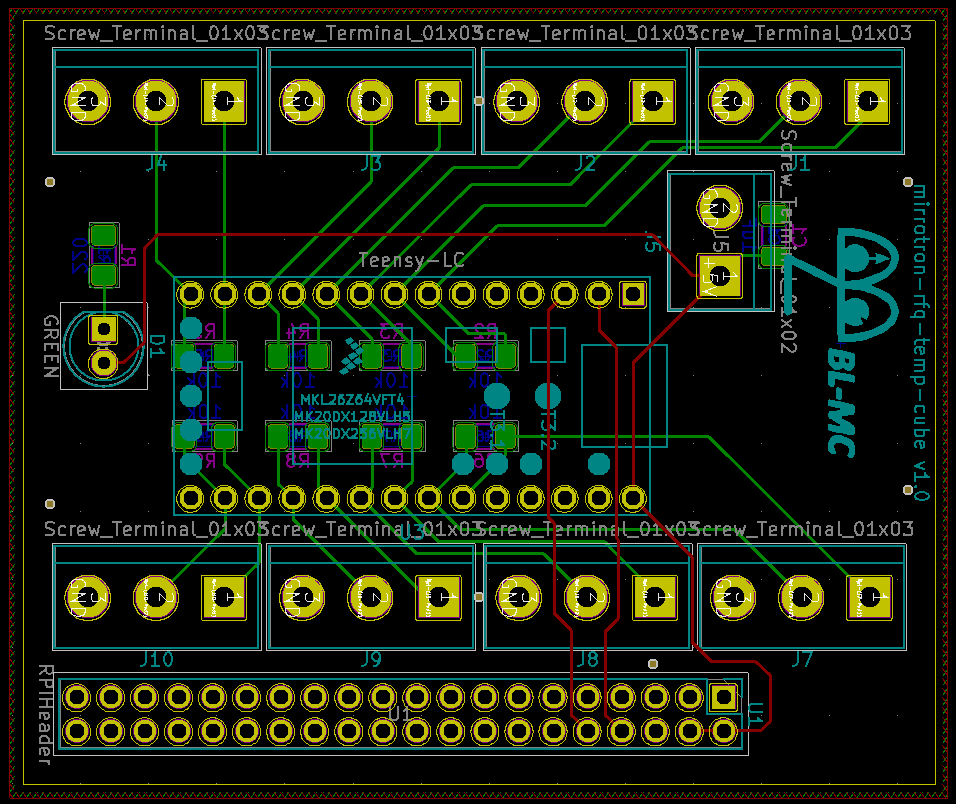

# RFQ Temperature Cube
* mirrotron-rfq-temp-cube <a href="https://github.com/bl-mirrotron/mirrotron-rfq-temp-cube" target="_blank">source code</a>
* [Cooling System Overview](https://bl-mirrotron.github.io/#cooling-system)

The function of the RFQ Temperature Cube is to measure the temperature of the cooling channels on both the upstream and downstream headers. The temperature is measured with <a href="https://www.maximintegrated.com/en/products/sensors/DS18B20.html#:~:text=The%20DS18B20%20communicates%20over%20a,for%20an%20external%20power%20supply." target="_blank">DS18B20</a> One-wire probes connected to a <a href="https://www.pjrc.com/teensy/teensyLC.html" target="_blank">Teensy-LC</a> as the micro-controller. The Teensy-LC communicates to a Blinky-LiteTM tray via the <a href="https://github.com/bl-mirrotron/mirrotron-rfq-temp-cube/blob/master/cubeCode/BlinkyBus.h" target="_blank">Blinky-Bus protocol</a> over the Serial1 port.

The schematic for the electrical circuit is shown in Figure 1. The board is designed to handle up to eight probes with each probe having it's own on/off power control if a individual channel needs a reboot. The PCB layout for the electrical circuit is shown in Figure 2. There is a 2x20 pin header mounted on the back of the PCB so that the cube can be directly mounted to a Raspberry Pi header for power and communications. A manufactured board is shown in Figure 3.

Figure 1.  Electrical Schematic for rfq-temp-cube board

 

Figure 2.  PCB layout for rfq-temp-cube board

 

Figure 3.  rfq-temp-cube

 
